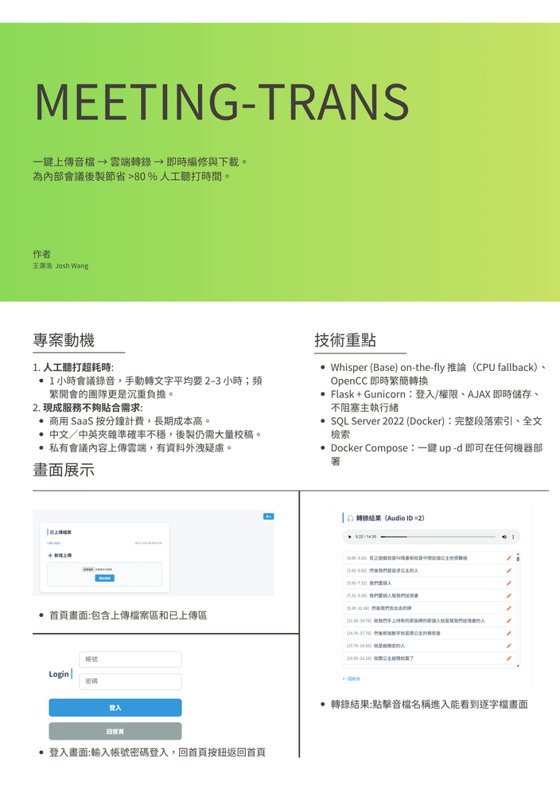

```mermaid
flowchart LR   
    %% ─── Nodes ─────────────────
    subgraph Browser
        A["User<br/>Browser"]
    end

    subgraph Backend["Flask + Gunicorn"]
        B["Flask App<br/>asr_core"]
        E["Uploads Volume"]
    end

    subgraph DB["SQL Server 2022"]
        C["SpeechDB"]
    end

    D["Whisper Base&nbsp;Model"]

    %% ─── Links ─────────────────
    A -->|HTTP REST| B
    B -->|ODBC| C
    B -->|Inference| D
    B -->|Save audio| E
    C ==> V[(dbdata&nbsp;volume)]
```

# 🎙️ Meeting-Trans — 會議錄音即時轉文字 & 線上編輯系統

> **動機**  
> - 每次開完會，都得花大把時間聽錄音、打逐字稿  
> - 線上轉錄服務昂貴、中文品質不穩  
> ➜ 自行打造「**上傳 → 自動轉錄 → 線上修訂**」的一條龍工具，  
---
## 專案示意圖


---

## ✨ 特色功能
| 模組 | 說明 |
| --- | --- |
| **🔊 音檔上傳** | 支援 MP3 / WAV / M4A…；進度條顯示處理狀態 |
| **📝 Whisper 轉錄** | OpenAI **Whisper-base**（CPU 版）<br> - 自動語言偵測<br> - 逐句時間軸 |
| **✍️ 線上逐句編輯** | Ajax 儲存、不重整頁面；段落即時更新 DB |
| **🔐 權限控管** | `flask-login`　Admin 登入後才可「改名 / 刪除 / 修改」檔案 |
| **📦 一鍵部署** | Dockerfile＋docker-compose；`.env` 參數化 |

---

## 🛠️  技術選型

| 類別 | 技術 & 理由 |
| --- | --- |
| 後端框架 | **Flask + Gunicorn** — 輕量、易快速迭代 |
| 語音轉文字 | **OpenAI Whisper** `base`；可替換 `faster-whisper`+GPU |
| DB | **Microsoft SQL Server 2022**（容器化，方便跨平台） |
| ORM | **SQLAlchemy** |
| 帳號系統 | **flask-login**, `werkzeug.security` PBKDF2 |
| 文字處理 | **OpenCC** — 簡⇄繁轉換 |
| 部署 | **Dockerfile** (python:3.11-slim)<br>**docker-compose**：`db`+`app` 服務 |
| CI | GitHub Actions（Lint / Build Image） |

---

## 🖼️ 系統架構


## 📂 專案架構
```text
meeting_trans/
├── app.py                 # Flask routes / auth
├── asr_core.py            # Whisper inference + DB helpers
├── requirements.txt
├── Dockerfile
├── docker-compose.yml
├── .env.example
│
├── uploads/               # ⬆️  runtime audio uploads (volume)
│
├── templates/             # Jinja2
│   ├── home.html
│   ├── result.html
│   ├── login.html
│   └── _navbar.html
│
└── static/
    ├── css/
    │   ├── home.css
    │   ├── result.css
    │   └── login.css
    └── js/
        ├── result.js
        └── progress.js
```


